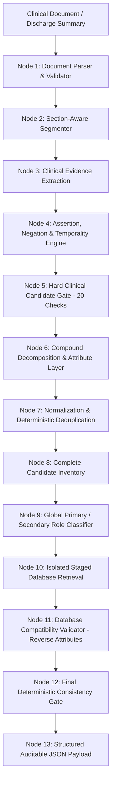

# PRODUCTION CLINICAL EVIDENCE EXTRACTION & DATABASE CODING ARCHITECTURE

## 1. System Philosophy & Absolute Non-Negotiables

The system operates strictly as a **clinical evidence extraction and database matching engine**. It establishes two completely independent, non-overlapping domains:

```
               CLINICAL DOCUMENT                             APPROVED EXCEL DATABASE
         (Single Authority for Evidence)                   (Single Authority for Codes)
      ┌───────────────────────────────────┐             ┌───────────────────────────────┐
      │  • WHAT diagnosis exists          │             │  • WHICH codes are available  │
      │  • WHETHER it is affirmed/active  │             │  • Official descriptions      │
      │  • WHETHER primary or secondary   │             │  • Permitted specificities    │
      │  • WHAT specificity is evidenced  │             │  • Active vs inactive status  │
      └─────────────────┬─────────────────┘             └───────────────┬───────────────┘
                        │                                               │
                        ▼                                               ▼
         ================================================================================
                                       ABSOLUTE PIPELINE ORDER
           DIAGNOSIS ──▶ VALIDATION ──▶ ROLE ──▶ DATABASE RETRIEVAL ──▶ COMPATIBILITY ──▶ CODE
         ================================================================================
```

### Absolute System Invariants
1. **INVARIANT 1**: No code without an established clinical diagnosis.
2. **INVARIANT 2**: No diagnosis without explicit textual evidence.
3. **INVARIANT 3**: No final diagnosis from metadata, section headers, or administrative templates.
4. **INVARIANT 4**: No final diagnosis from medication or prescription names alone.
5. **INVARIANT 5**: No ruled-out, negated, or unmanaged historical diagnosis in final output.
6. **INVARIANT 6**: Code specificity may NEVER exceed evidence specificity (`CODE_SPECIFICITY <= EVIDENCE_SPECIFICITY`).
7. **INVARIANT 7**: The database retriever is a mapper, NEVER a diagnosis detector. A retrieved code must NEVER create or alter a diagnosis.
8. **INVARIANT 8**: Candidate independence: each candidate possesses an isolated retrieval context. Zero shared top-K; zero cross-candidate rank contamination.
9. **INVARIANT 9**: Primary / Secondary role classification occurs strictly after the complete candidate inventory is constructed and deduplicated.
10. **INVARIANT 10**: Duplicate clinical concepts merge into exactly ONE canonical diagnosis object.
11. **INVARIANT 11**: The database is immutable and read-only. No codes may be added, altered, or inferred.
12. **INVARIANT 12**: Every final ICD code must exist in `Database/` with verifiable provenance.
13. **INVARIANT 13**: Every accepted code must be compatible with the evidenced attributes.
14. **INVARIANT 14**: Ambiguity or missing attribute specificity results in deterministic ABSTENTION (`NO_DATABASE_MATCH`).
15. **INVARIANT 15**: Zero hardcoded cases, filenames, patients, or benchmark-specific overrides.
16. **INVARIANT 16**: The architecture generalizes across unseen clinical documents and specialty domains.

---

## 2. End-to-End Typed Pipeline Workflow



---

## 3. Core Architectural Modules & Components

### 3.1 Document Ingestion & Section Segmentation (`ingestion/`, `clinical_extractor.py`)
- Segment text into 20+ recognized clinical sections (Discharge Diagnoses, Admitting Diagnoses, Reason for Admission, Chief Complaints, HPI, PMH, Hospital Course, Procedures, Investigations, Microbiology, Medications, Follow-up, Allergies, Metadata).
- Every extracted fact retains:
  - `source_section`: Exact clinical section name
  - `source_text`: Verbatim sentence
  - `source_span`: Character index tuple `(start, end)`

### 3.2 Assertion, Negation & Temporality Engine (`clinical_extractor.py`, `classifier.py`)
- Negation detection: Identifies affirmative evidence vs explicit negations (`"ruled out"`, `"no evidence of"`, `"negative for"`).
- Temporality classifier: Separates `CURRENT`, `HISTORICAL`, `FUTURE`, and `UNCLEAR`.
- Pre-existing PMH comorbidity resolution: Pre-existing conditions (e.g., T2DM, HTN, CKD) are cross-referenced with inpatient management evidence (medications, bedside monitoring, lab evaluation). If actively managed, marked `CURRENT`; if unmanaged history (e.g., history of falling), marked `HISTORICAL` and excluded.

### 3.3 Hard Clinical Candidate Gate (`clinical_gate.py`)
Deterministic 20-point validation gate. Any candidate failing any check is rejected immediately prior to retrieval:
1. Meaningful clinical condition
2. Supported by explicit clinical evidence
3. Not negated or ruled out
4. Not hypothetical or differential
5. Not a section header (e.g., `"BIOMARKERS & RECEPTOR STATUS"`)
6. Not metadata or template artifact (e.g., `"Classification of Fracture: Not Applicable"`)
7. Not an isolated anatomical location (e.g., `"Left foot"`, `"Chest"`)
8. Not a pharmaceutical dosage or medication name (e.g., `"Cremaffin"`, `"Alex lozenges"`)
9. Not a treatment instruction or directive (e.g., `"Watch for reactions"`, `"Follow up"`)
10. Not a procedure or surgical intervention unless documented as a postoperative diagnosis
11. Not an isolated laboratory value or vital sign measurement
12. Not a symptom unless symptom coding is appropriate under CMS Guideline I.B.4
13. Not a disease attribute (e.g., `"Stage IV"`, `"Grade III"`)
14. Not a staging classification
15. Not molecular or genetic markers (e.g., `"BRCA pathogenic"`)
16. Not receptor status (e.g., `"Triple negative"`, `"PD-L1 positive"`)
17. Not pathology classification alone
18. Not unmanaged historical condition
19. Does not contain unsupported specificity
20. Has sufficient evidence to distinguish it from nearby concepts

### 3.4 Compound Diagnosis Decomposer & Attribute Layer
- **Orthopedic Decomposition**: Decomposes complex fracture/sprain narratives:
  `"Multiple fractures of left lateral malleolus, tarsals and fifth metatarsal with deltoid and calcaneofibular ligament sprains"`
  into atomic candidates:
  - `left lateral malleolus fracture`
  - `left tarsal fracture`
  - `left fifth metatarsal fracture`
  - `left deltoid ligament sprain`
  - `left calcaneofibular ligament sprain`
  Distributes shared laterality (`left`) and fracture entity.
- **Oncology Representation (`CancerConcept`)**:
  Encapsulates `primary_site`, `laterality`, `histology`, `stage`, `grade`, `receptor_status`, `molecular_attributes`, `metastatic_status`, and `metastatic_sites`.
  - Attributes (`Triple negative`, `BRCA`, `PD-L1`, `Stage IV`) are attached to the primary neoplasm, NEVER sent to ICD retrieval as standalone diseases.
  - Linked metastatic manifestations (e.g., `pleural metastasis`) are routed to Chapter 2 secondary neoplasms (`C77-C79`), preventing generic symptom misclassification.

### 3.5 Deduplication & Complete Candidate Inventory
- Semantic deduplication merges duplicate mentions across different sections into ONE canonical candidate with merged evidence spans.
- Classification occurs globally over the complete candidate inventory, preventing sequential replacement bugs.

### 3.6 Primary vs. Secondary Role Classification (`classifier.py`)
- Evaluates UHDDS inpatient hierarchy:
  1. Condition occasioning admission established after study
  2. Condition driving major therapeutic or surgical intervention
  3. Condition dominating hospital course
- Provider explicit designation (`PRIMARY DIAGNOSIS:`, `PRINCIPAL DIAGNOSIS:`) receives overwhelming priority (+10.0).
- Chronicity penalties are strictly forbidden from overriding explicit provider role documentation.
- Exactly ONE primary diagnosis is selected; secondary diagnoses must be active, managed, or documented comorbidities.

### 3.7 Constrained Database Retrieval (`retrieval/hybrid.py`, `lexical.py`)
- Isolated context per candidate: no shared candidate pool.
- Staged filtering before semantic ranking:
  1. Concept / family match
  2. Anatomical site filtering
  3. Laterality filtering
  4. Etiology filtering
  5. Active code filtering (`active_yesno = 1`)
- Lexical BM25 + dense FAISS embeddings with clinical tokenization.

### 3.8 Database Compatibility Validator (`reverse_attributes.py`, `ranker.py`)
- Enforces `CODE_SPECIFICITY <= EVIDENCE_SPECIFICITY`.
- Reverse attribute extraction: Extracts every qualifier from the candidate database description (e.g., `displaced`, `bilateral`, `with bleeding`, `type 2`, `streptococcal`).
- If the candidate code requires a positive attribute that is not evidenced in the clinical record:
  - The code is disqualified.
  - If no compatible codes exist, the system triggers `NO_DATABASE_MATCH` and abstains.

### 3.9 Final Deterministic Consistency Gate (`validation/deterministic.py`, `nodes.py`)
- Validates the entire output bundle against official coding rules:
  - HIPAA valid terminal leaf codes
  - CMS Excludes1 and Excludes2 constraints
  - Code existence in canonical database
  - Provenance audit trail verification

---

## 4. Final Output Payload Schema

```json
{
  "document_id": "case-sample-01",
  "status": "COMPLETED",
  "primary_diagnosis": {
    "raw_term": "Metastatic breast cancer",
    "normalized_diagnosis": "Malignant neoplasm of unspecified site of female breast",
    "code": "C50.919",
    "description": "Malignant neoplasm of unspecified site of unspecified female breast",
    "role": "PRIMARY",
    "acuity": "CHRONIC",
    "certainty": "CONFIRMED",
    "evidence_quote": "Patient with known metastatic breast cancer presented for restaging and systemic therapy adjustment.",
    "confidence_score": 0.95,
    "matching_status": "MATCHED",
    "database_code": "C50.919",
    "database_description": "Malignant neoplasm of unspecified site of unspecified female breast",
    "database_source": "Database_2.xlsx::ICD 10-1::row_14321",
    "source_section": "PRINCIPAL_DIAGNOSIS"
  },
  "secondary_diagnoses": [
    {
      "raw_term": "Pleural metastasis",
      "normalized_diagnosis": "Secondary malignant neoplasm of pleura",
      "code": "C78.2",
      "description": "Secondary malignant neoplasm of pleura",
      "role": "SECONDARY",
      "acuity": "CHRONIC",
      "certainty": "CONFIRMED",
      "evidence_quote": "CT chest confirmed progressive malignant pleural metastasis secondary to breast carcinoma.",
      "confidence_score": 0.92,
      "matching_status": "MATCHED",
      "database_code": "C78.2",
      "database_description": "Secondary malignant neoplasm of pleura",
      "database_source": "Database_2.xlsx::ICD 10-1::row_18920",
      "source_section": "SECONDARY_DIAGNOSES"
    }
  ],
  "abstentions": [],
  "excluded_candidates": [
    {
      "text": "Triple negative",
      "reason": "ATTRIBUTE"
    },
    {
      "text": "BRCA pathogenic mutation",
      "reason": "ATTRIBUTE"
    },
    {
      "text": "PD-L1 positive",
      "reason": "ATTRIBUTE"
    },
    {
      "text": "BIOMARKERS & RECEPTOR STATUS",
      "reason": "METADATA"
    }
  ],
  "validation": {
    "evidence_grounded": true,
    "database_grounded": true,
    "unsupported_specificity": false,
    "hallucinated_codes": false,
    "noise_capture": false,
    "duplicate_candidates": false,
    "primary_secondary_validated": true
  }
}
```
