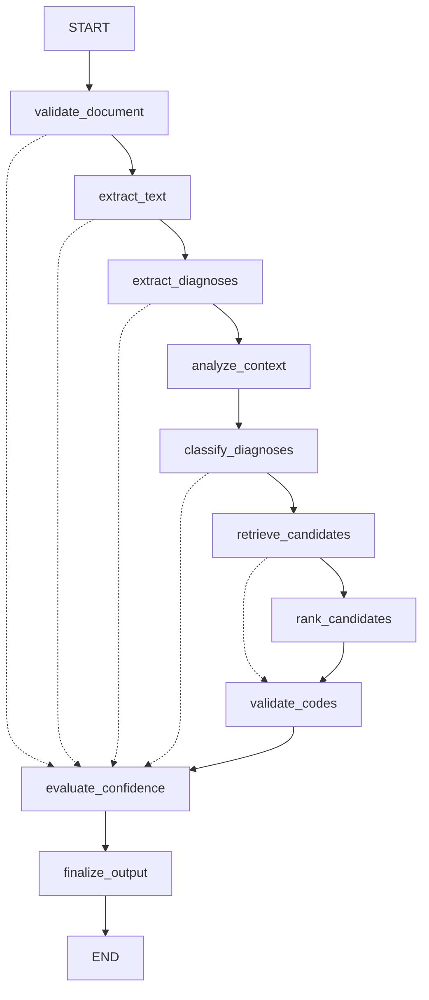

# System Architecture Report: Local Medical ICD-10-CM Coding System

**Role**: Senior Production Architect  
**Architecture Paradigm**: Deterministic-First, Retrieval-Augmented Graph State Machine  
**Workflow Engine**: LangGraph  
**LLM Layer**: Local GGUF (via GPT4All / llama.cpp)  
**Retrieval Engine**: Local Hybrid (BM25Okapi + FAISS Cosine Dense Embeddings)  
**Language**: Python 3.13.13  

---

## 1. System Architectural Overview

The system is engineered as an offline, air-gapped clinical intelligence platform that accepts hospital discharge summaries (in plain text or PDF format) and emits evidence-grounded, verified ICD-10-CM coding decisions conforming strictly to the official CMS/CDC ICD-10-CM Official Guidelines for Coding and Reporting and the Uniform Hospital Discharge Data Set (UHDDS).

### Core Architectural Axioms:
1. **The LLM is Never the Source of Truth**: The local LLM does not generate or memorize ICD codes. All candidate codes are derived exclusively from the authoritative local ICD-10-CM catalog.
2. **Deterministic-First Segregation**: Deterministic clinical rules (existence, negation, temporality, PMH exclusion, terminal specificity, hierarchy) are executed via Python functions. Local LLMs are engaged only where natural language understanding is genuinely required (complex narrative extraction, evidence-to-candidate alignment).
3. **Decoupled Concurrency**: Document ingestion concurrency (processing $\ge 10$ documents simultaneously) is strictly separated from model-level inference concurrency (sequential execution protected by a reentrant thread lock to avoid llama.cpp memory corruption).
4. **Verbatim Evidence Provenance**: Every assigned code is anchored to an exact textual quote from the source discharge summary, retaining character spans and section identifiers.

---

## 2. Layered Architecture

```
┌────────────────────────────────────────────────────────────────────────┐
│                        FastAPI REST Layer                              │
│   /health   |   /api/v1/code/text   |   /api/v1/code/pdf   |   /batch  │
└───────────────────────────────────┬────────────────────────────────────┘
                                    │
┌───────────────────────────────────▼────────────────────────────────────┐
│                    Orchestration & Concurrency Layer                   │
│   MedicalCodingPipeline   |   BoundedDocumentGate (asyncio.Semaphore)  │
└───────────────────────────────────┬────────────────────────────────────┘
                                    │
┌───────────────────────────────────▼────────────────────────────────────┐
│                         LangGraph Workflow                             │
│   PipelineGraphState  |  10 Sequential Nodes  |  Conditional Routing   │
└───────┬───────────────────────────┬───────────────────────────┬────────┘
        │                           │                           │
┌───────▼─────────────┐   ┌─────────▼─────────────┐   ┌─────────▼────────┐
│ Clinical Extraction │   │ Context & Classify    │   │ Retrieval Layer  │
│ PyMuPDF / Fallback  │   │ Negation/Acuity/PMH   │   │ FAISS Dense      │
│ Entity Subsumption  │   │ Max 1 Primary UHDDS   │   │ BM25 Lexical     │
└─────────────────────┘   └───────────────────────┘   └─────────┬────────┘
                                                                │
┌───────────────────────────────────────────────────────────────▼────────┐
│                        Candidate Ranking Layer                         │
│   CandidateRankingAgent  |  Strict Candidate Pool Constrained Ranking  │
└───────────────────────────────────┬────────────────────────────────────┘
                                    │
┌───────────────────────────────────▼────────────────────────────────────┐
│                  Deterministic Guardrails & Validation                 │
│   Catalog Existence | Terminal Specificity | Excludes1 | Audit Trail   │
└───────────────────────────────────┬────────────────────────────────────┘
                                    │
┌───────────────────────────────────▼────────────────────────────────────┐
│                         Final Response Schema                          │
│   CodingResult  |  CodedDiagnosisResponse  |  AbstentionRecord         │
└────────────────────────────────────────────────────────────────────────┘
```

---

## 3. LangGraph 10-Node Target Workflow Topology

The core business logic is compiled as a directed acyclic state graph with short-circuit error routing:



### Detailed Node Specifications:
1. **Node 1: `validate_document`**: Validates payload structure, checks file existence and non-zero byte size, rejecting unreadable inputs.
2. **Node 2: `extract_text`**: Ingests PDF/text, extracts text with PyMuPDF, detects scanned image-only PDFs, and performs whitespace normalization.
3. **Node 3: `extract_diagnoses`**: Identifies diagnostic mentions with verbatim evidence quotes and offsets. Applies clinical condition subsumption to eliminate generic duplicates.
4. **Node 4: `analyze_context`**: Evaluates negation ("ruled out", "denies"), temporality (historical vs current), and clinical management (monitoring/therapy).
5. **Node 5: `classify_diagnoses`**: Enforces official UHDDS rules: establishes at most ONE primary diagnosis. Flags ambiguous ties for physician query.
6. **Node 6: `retrieve_candidates`**: Executes parallel dense (FAISS) and lexical (BM25) search against the local ICD dataset exclusively for billable conditions.
7. **Node 7: `rank_candidates`**: Aligns candidate codes with documented evidence. Restricts selection strictly to the retrieved candidate pool.
8. **Node 8: `validate_codes`**: Deterministic verification: validates catalog existence, leaf specificity, and consolidates duplicate ICD codes.
9. **Node 9: `evaluate_confidence`**: Synthesizes aggregate confidence metrics, generates structured abstentions, and compiles the diagnosis audit trail.
10. **Node 10: `finalize_output`**: Emits the terminal Pydantic `CodingResult` payload omitting raw LLM prompt deliberations.

---

## 4. Concurrency & Parallelism Architecture

### Document-Level vs Model-Level Concurrency:
- **Document-Level Parallelism**: Enabled by `BoundedDocumentGate` (`asyncio.Semaphore(10)`). Up to 10 clinical documents undergo text extraction, section segmentation, and candidate retrieval concurrently on the event loop.
- **Model-Level Concurrency**: Managed by `LLMLifecycleManager`. Local CPU inference on GGUF weights cannot safely execute in parallel across multiple threads without severe thread contention and risk of context corruption. An internal `threading.Lock()` serializes LLM inferences, while an `asyncio.Semaphore(1)` queues asynchronous callers without blocking the event loop.

---

## 5. Local Retrieval Architecture

The retrieval system ensures that the model is never exposed to arbitrary open-world hallucinated codes:
- **Lexical Index**: `BM25Okapi` indexing normalized descriptions, clinical synonyms, and inclusion terms.
- **Dense Vector Index**: FAISS FlatIP index computing cosine similarity over dense 384-dimensional embeddings generated by local sentence transformers.
- **Hybrid Fusion Formula**:
  $$Score_{hybrid}(c) = 0.6 \cdot S_{semantic}(c) + 0.4 \cdot S_{lexical}(c)$$
- **Catalog Boundary Filter**: Candidates not present in `LocalICDCatalog` are filtered before candidate ranking.
