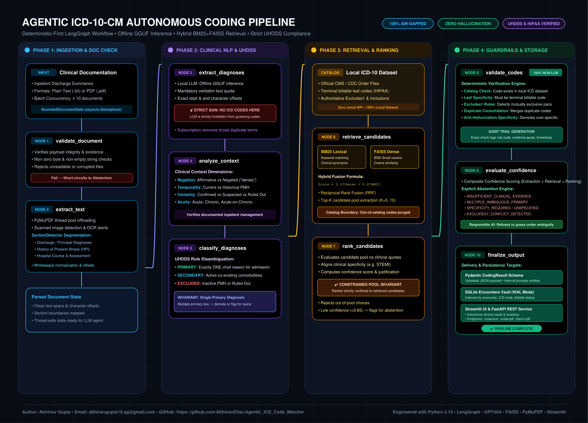
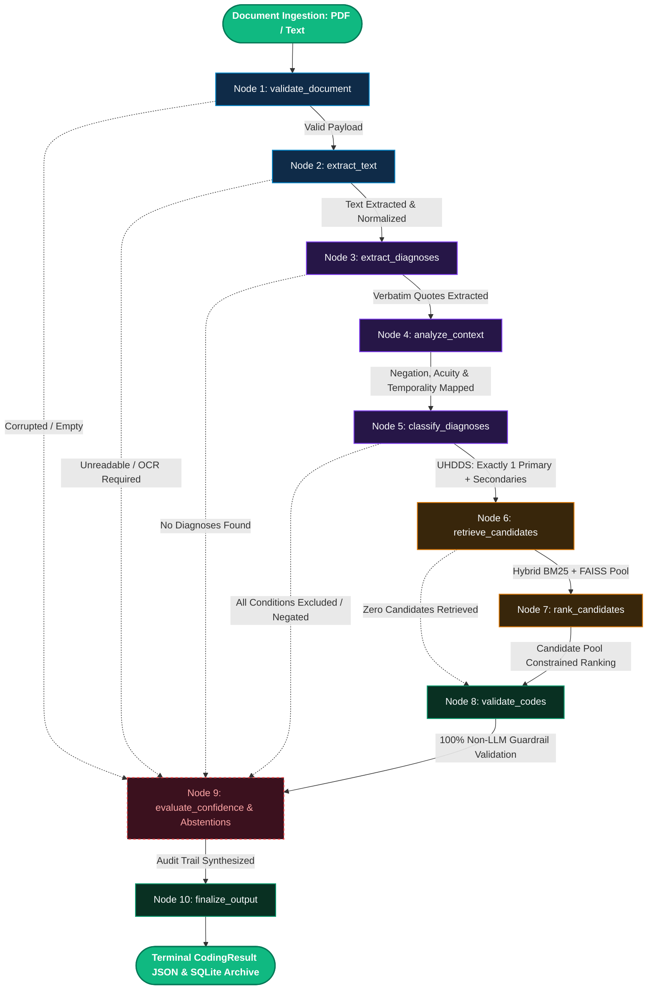

# 🏥 Agentic ICD-10-CM Autonomous Code Matcher

<div align="center">

[](https://www.python.org/)
[](https://github.com/langchain-ai/langgraph)
[-orange.svg)](https://gpt4all.io/)
[](https://github.com/facebookresearch/faiss)
[](https://streamlit.io/)
[](https://fastapi.tiangolo.com/)
[](tests/)
[](https://github.com/astral-sh/ruff)
[](https://www.cms.gov/medicare/coding-billing/icd-10-codes)
[-darkgreen.svg)](#security--data-privacy)

**A deterministic-first, retrieval-augmented LangGraph architecture for autonomous, air-gapped clinical ICD-10-CM coding from inpatient discharge summaries.**

---

### 👨‍💻 Author & Contact
**Abhinav Gupta**  
📧 **Email**: [abhinavgupta15.ag@gmail.com](mailto:abhinavgupta15.ag@gmail.com)  
🐙 **GitHub**: [@AbhinavEliac](https://github.com/AbhinavEliac)  
📦 **Repository**: [https://github.com/AbhinavEliac/Agentic_ICD_Code_Matcher](https://github.com/AbhinavEliac/Agentic_ICD_Code_Matcher)

</div>

---

## 📑 Table of Contents

- [1. Executive Summary](#1-executive-summary)
- [2. Architectural Axioms & Medical Safety](#2-architectural-axioms--medical-safety)
- [3. End-to-End Workflow & Flowchart Architecture](#3-end-to-end-workflow--flowchart-architecture)
  - [Crisp Workflow Flowchart Diagram](#crisp-workflow-flowchart-diagram)
  - [Interactive State Graph (Mermaid)](#interactive-state-graph-mermaid)
  - [Detailed 10-Node Execution Breakdown](#detailed-10-node-execution-breakdown)
- [4. Technology Stack](#4-technology-stack)
- [5. Repository Architecture](#5-repository-architecture)
- [6. Installation & Environment Setup](#6-installation--environment-setup)
- [7. Dataset Ingestion & Offline Indexing](#7-dataset-ingestion--offline-indexing)
- [8. Running the Application](#8-running-the-application)
  - [Clinical Streamlit Dashboard](#clinical-streamlit-dashboard)
  - [FastAPI REST API](#fastapi-rest-api)
- [9. Concurrent Batch Processing (>= 10 PDFs)](#9-concurrent-batch-processing--10-pdfs)
- [10. Verification, Testing & Diagnostic Case Studies](#10-verification-testing--diagnostic-case-studies)
- [11. Security & Data Privacy (HIPAA Compliance)](#11-security--data-privacy-hipaa-compliance)
- [12. License](#12-license)

---

## 1. Executive Summary

In clinical health systems, autonomous medical coding is high-stakes. Traditional approaches using generic generative Large Language Models (LLMs) suffer from severe flaws:
- **Hallucinated Codes**: Inventing plausible-looking ICD-10-CM codes that do not exist or violate billing rules.
- **Over-Specificity & Upcoding**: Defaulting to the most severe or granular diagnostic code without documentary evidence.
- **Violation of UHDDS Rules**: Inability to identify a single primary reason for admission versus chronic active comorbidities.
- **Privacy Breaches**: Transmitting Protected Health Information (PHI) to third-party cloud APIs.

**Agentic ICD Code Matcher** solves this by establishing a **deterministic-first, dual-engine retrieval pipeline** orchestrated with **LangGraph**:
1. **The LLM is strictly an NLP engine**: It extracts clinical diagnoses with verbatim text evidence, assesses clinical context (negation, temporality, certainty, acuity), and ranks candidates. It is **categorically banned** from inventing or outputting ICD codes.
2. **The local CMS/CDC ICD-10-CM catalog is the sole source of truth**: Only valid, terminal billable leaf codes can be selected.
3. **Deterministic Guardrails**: 100% programmatic Python verification enforces catalog existence, HIPAA leaf specificity, *Excludes1* mutual exclusions, and the single-primary invariant.
4. **100% Offline & Air-Gapped**: Runs entirely locally via GPT4All (local GGUF weights), SentenceTransformers, and FAISS. Zero cloud egress.

---

## 2. Architectural Axioms & Medical Safety

| # | Medical Invariant | How It Is Strictly Enforced | Failure Action |
|:--|:---|:---|:---|
| **1** | **No ICD Code Generation by LLM** | The extraction prompt bans code generation. Model outputs only clinical conditions + verbatim documentary evidence. | Output filtered; only retrieved candidates considered. |
| **2** | **Catalog Boundary Guarantee** | Candidates retrieved via BM25 + FAISS are cross-checked against `LocalICDCatalog`. Non-existent codes are discarded prior to ranking. | Code purged from candidate pool. |
| **3** | **Single Primary Diagnosis** | Official UHDDS definition enforced: maximum ONE primary condition chiefly responsible for admission. | Multiple primary candidates demoted or routed to physician query. |
| **4** | **Verbatim Evidence Provenance** | Every code must link to an exact textual quote and character offsets from the clinical narrative. | Diagnosis without evidence is discarded. |
| **5** | **Historical & Ruled-Out Exclusion** | Negated ("denies", "no evidence of") and unmanaged historical PMH conditions are classified as `EXCLUDED`. | Marked non-billable; omitted from coding submission. |
| **6** | **Terminal Leaf Specificity** | Non-billable category headers (e.g. 3-character codes) are rejected; only terminal leaf nodes are valid. | Realigned to valid terminal code or abstained. |
| **7** | **Mutual Excludes1 Detection** | Pairs violating CDC *Excludes1* guidelines cannot be co-billed. | Conflict flagged; lower priority code dropped or queried. |
| **8** | **Auditable Abstention Engine** | Whenever evidence is insufficient or ambiguous, the pipeline emits a structured `AbstentionRecord`. | Explicit diagnostic abstention reasoning logged. |

---

## 3. End-to-End Workflow & Flowchart Architecture

### Crisp Workflow Flowchart Diagram

Below is the architectural workflow flowchart illustrating the 4 distinct execution phases, 10 LangGraph nodes, concurrency boundaries, retrieval engines, and deterministic guardrails.

<div align="center">
  
  <p><em>Figure 1: Complete end-to-end architecture and state machine topology.</em></p>
  <p><a href="docs/assets/workflow_flowchart.svg">🔍 Click here to view the high-resolution Scalable Vector Graphic (SVG)</a></p>
</div>

---

### Interactive State Graph (Mermaid)

The workflow is compiled as a directed acyclic state graph with short-circuit failure bypass routes:



---

### Detailed 10-Node Execution Breakdown

#### Phase 1: Ingestion & Document Verification
* **Input Gateway**: Clinical documents arrive as plain text or `.pdf` discharge summaries. Concurrent ingestion of $\ge 10$ documents is managed via `BoundedDocumentGate` (`asyncio.Semaphore(10)`).
* **Node 1 (`validate_document`)**: Validates payload structure, checks file existence and non-zero byte size. Unreadable inputs short-circuit directly to the abstention engine.
* **Node 2 (`extract_text`)**: PyMuPDF extraction executed off-thread (`asyncio.to_thread`) to prevent event-loop blocking. Employs `SectionDetector` to parse clinical sections (*History of Present Illness*, *Assessment & Plan*, *Hospital Course*, *Discharge Diagnoses*) and normalizes whitespace while capturing character spans.

#### Phase 2: Clinical Language Understanding & UHDDS Context
* **Node 3 (`extract_diagnoses`)**: A local LLM extracts diagnostic entities. **Core Constraint**: Must provide exact verbatim quotes and offsets from the text. The model is strictly prohibited from inventing or assigning ICD codes. Clinical condition subsumption removes broad duplicate mentions.
* **Node 4 (`analyze_context`)**: Evaluates diagnostic mentions across 4 axes:
  - **Negation**: `AFFIRMATIVE` vs `NEGATED` ("denies chest pain", "ruled out").
  - **Temporality**: `CURRENT` vs `HISTORICAL` (PMH) vs `FAMILY_HISTORY`.
  - **Certainty**: `CONFIRMED` vs `SUSPECTED` vs `RULED_OUT`.
  - **Acuity**: `ACUTE` vs `CHRONIC` vs `ACUTE_ON_CHRONIC` vs `UNSPECIFIED`.
* **Node 5 (`classify_diagnoses`)**: Enforces official Uniform Hospital Discharge Data Set (UHDDS) rules. Designates at most **ONE** Primary Diagnosis (chief reason for admission). Active co-existing conditions are classified as Secondary. Historical conditions without active inpatient monitoring/treatment are classified as `EXCLUDED`.

#### Phase 3: Dual-Engine Retrieval & Pool-Constrained Ranking
* **Node 6 (`retrieve_candidates`)**: Queries the authoritative local ICD-10-CM dataset using a dual search mechanism:
  - **Lexical Search (BM25Okapi)**: Keyword matching against official descriptions and clinical synonyms.
  - **Semantic Dense Search (FAISS FlatIP)**: Cosine similarity over 384-dimensional vector embeddings generated by local sentence transformers.
  - **Hybrid Fusion**: Computes composite rank using Reciprocal Rank Fusion (RRF) and weighted scoring:  
    $$\text{Score}_{\text{hybrid}} = 0.6 \cdot \text{Score}_{\text{dense}} + 0.4 \cdot \text{Score}_{\text{lexical}}$$
  - **Catalog Boundary Filter**: Purges any candidate not strictly in the local catalog.
* **Node 7 (`rank_candidates`)**: The local LLM evaluates retrieved candidate codes against verbatim clinical evidence. **Constrained Pool Invariant**: The ranker can select *only* from the top-$K$ retrieved candidates. Out-of-pool codes and hallucinated candidates are rejected.

#### Phase 4: Deterministic Guardrails, Abstention & Storage
* **Node 8 (`validate_codes`)**: A 100% programmatic Python engine (non-LLM) verifying:
  1. *Catalog Existence*: Confirms code exists in the official CMS/CDC table.
  2. *Terminal Leaf Specificity*: Verifies the code is a HIPAA-billable leaf node (rejecting 3-character category headers).
  3. *Excludes1 Rules*: Detects and prevents co-billing of mutually exclusive conditions.
  4. *Anti-Hallucination Specificity*: Demotes overly specific codes unsupported by text.
* **Node 9 (`evaluate_confidence`)**: Computes composite confidence scores across extraction, retrieval, and ranking. Generates explicit `AbstentionRecord` entries when clinical documentation is ambiguous, ruled out, or conflicting.
* **Node 10 (`finalize_output`)**: Formulates the terminal Pydantic `CodingResult` schema (omitting internal LLM deliberations), archives the encounter into SQLite with WAL mode, and returns the response to the user or API client.

---

## 4. Technology Stack

| Category | Component / Tool | Version / Specification | Technical Role & Invariants |
|---|---|---|---|
| **Language** | **Python** | `3.13.13` | Modern typing, asyncio concurrency, zero-GIL preparation |
| **Workflow Engine** | **LangGraph** | `>=0.2.0` | 10-node state graph, conditional edges, error short-circuiting |
| **Local LLM Layer** | **GPT4All / llama.cpp** | Local GGUF (e.g. Mistral-7B-Instruct) | Offline inference, `allow_download=False`, thread-safe singleton lock |
| **Embeddings** | **SentenceTransformers** | BGE-Small-EN / FastLocal | 384-dim dense vectors, 100% local, cosine similarity |
| **Vector Retrieval** | **FAISS** | `faiss-cpu` (FlatIP) | High-speed dense similarity search over ICD descriptions |
| **Lexical Retrieval** | **rank-bm25** | `BM25Okapi` | Fast inverted index keyword matching & inclusion terms |
| **PDF Extraction** | **PyMuPDF (fitz)** | `>=1.24.0` | High-fidelity text extraction, section segmentation, OCR detection |
| **Web Interface** | **Streamlit** | `>=1.38.0` | Clinical workspace, batch PDF uploader, SQLite vault browser |
| **REST Service** | **FastAPI** | `>=0.112.0` | Non-blocking async endpoints, OpenAPI/Swagger documentation |
| **Persistence** | **SQLite + SQLAlchemy** | WAL (Write-Ahead Logging) | Thread-safe, transaction-isolated clinical encounter vault |
| **Schema Validation**| **Pydantic** | `v2.x` | Strict typing, runtime invariant checking, serialization |
| **Quality & Tests** | **Pytest & Ruff** | 120 Unit/Integration Tests | 100% passing test suite, strict zero-lint-error code standard |

---

## 5. Repository Architecture

```
Agentic_ICD_Code_Matcher/
├── .env.example                      # Environment variables configuration template
├── .gitignore                        # Git rules (virtualenvs, models, SQLite databases)
├── pyproject.toml                    # Project specification, dependencies, ruff/pytest configs
├── README.md                         # Comprehensive architecture & operational documentation
├── requirements.txt                  # Locked Python package dependencies
├── app.py                            # Streamlit clinical workspace entrypoint
├── diagnostic_pipeline_report.json   # Benchmark evaluation results across clinical test cases
│
├── data/
│   ├── icd10/                        # CMS/CDC ICD-10-CM source files & sample test dataset
│   │   ├── .gitkeep
│   │   └── sample_hospital_icd.csv   # Pre-bundled verified sample dataset
│   ├── indexes/                      # Persisted FAISS and BM25 offline index artifacts
│   │   ├── .gitkeep
│   │   ├── bm25_index.pkl            # Pre-indexed BM25 token cache
│   │   ├── faiss.index               # FAISS vector index
│   │   ├── faiss_records.json        # Indexed record mappings
│   │   ├── icd_catalog.json          # Pre-built authoritative catalog metadata
│   │   └── index_stats.json          # Indexing telemetry and count
│   └── samples/                      # Sample clinical discharge summary PDFs and texts
│
├── docs/
│   └── assets/                       # Vector and high-resolution architecture diagrams
│       ├── workflow_flowchart.png    # Ultra-crisp high-resolution PNG diagram
│       └── workflow_flowchart.svg    # Scalable vector graphics (SVG) diagram
│
├── models/                           # Local offline model weights storage
│   ├── embeddings/                   # SentenceTransformer model files
│   └── gguf/                         # Quantized GGUF LLM weights (e.g. Mistral-7B)
│
├── scripts/                          # Utility & indexing CLI scripts
│   ├── generate_flowchart.py         # SVG & high-res PNG flowchart generator
│   ├── index_icd.py                  # CLI pipeline to ingest & index ICD datasets
│   └── run_pipeline_diagnostic_report.py # Automated end-to-end benchmark evaluator
│
├── src/medical_coding/               # Core source package
│   ├── agents/                       # Specialized reasoning agents (extractor, classifier, ranker)
│   ├── api/                          # FastAPI application, dependency injection, routes
│   ├── config/                       # Typed Pydantic Settings & environment manager
│   ├── database/                     # SQLite models, repository, WAL connection manager
│   ├── dataset/                      # CMS order file loaders & LocalICDCatalog engine
│   ├── graph/                        # LangGraph 10-node workflow, states, and transitions
│   ├── models/                       # Local model wrappers, lifecycle singleton, lock manager
│   ├── orchestration/                # MedicalCodingPipeline async pipeline driver
│   ├── pdf/                          # PyMuPDF extractor & concurrent BatchPDFProcessor
│   ├── prompts/                      # Strict system prompts with evidence & boundary constraints
│   ├── retrieval/                    # BM25 lexical, FAISS dense, and Hybrid RRF retrievers
│   ├── schemas/                      # Pydantic domain models, state schemas, API payloads
│   ├── ui/                           # Streamlit layout, decision cards, sample test cases
│   ├── utils/                        # Logging, string matching, ICD format helpers
│   └── validation/                   # 100% deterministic rules & AbstentionEngine
│
└── tests/                            # 120 unit, integration, and end-to-end tests
    ├── test_api.py                   # FastAPI endpoint validation
    ├── test_candidate_ranking.py     # Pool-constrained candidate ranking tests
    ├── test_classification.py        # UHDDS single primary classification tests
    ├── test_clinical_extraction.py   # Verbatim quote & span extraction tests
    ├── test_config.py                # Environment configuration tests
    ├── test_context_assessment.py    # Negation, temporality, certainty, acuity tests
    ├── test_database.py              # SQLite WAL mode & encounter persistence tests
    ├── test_end_to_end_pipeline.py   # Complete 10-node LangGraph integration tests
    ├── test_graph.py                 # Graph compilation & topology tests
    ├── test_imports.py               # Zero circular dependency checks
    ├── test_ingestion.py             # Dataset loader & catalog integrity tests
    ├── test_llm_infrastructure.py    # Offline model lifecycle & inference locking tests
    ├── test_multimodal_e2e.py        # Plaintext + PDF multimodal verification tests
    ├── test_pdf_processing.py        # PyMuPDF & concurrency semaphore tests
    ├── test_retrieval.py             # BM25, FAISS, and hybrid RRF tests
    ├── test_schemas.py               # Pydantic schema validation tests
    ├── test_state.py                 # State transitions & execution snapshot tests
    └── test_validation.py            # Deterministic rule & Excludes1 tests
```

---

## 6. Installation & Environment Setup

### 🚀 Automated Quick-Start Installers (Windows & Linux)

The repository provides cross-platform installer scripts that automate the entire setup:
- Creates a clean Python virtual environment (`env`)
- Upgrades `pip`, `setuptools`, and `wheel`
- Installs all dependencies from `requirements.txt`
- Configures `.env` from `.env.example`
- Detects the local `Database/` folder (ICD-10-CM, ICD-O, CPT) and builds/verifies FAISS & BM25 search indexes

> [!IMPORTANT]
> **Strict Separation of Concerns**: The installer scripts **only** install and configure the environment. They **do not** start the application. Use the dedicated runner scripts to start the app.

#### Windows (Batch or PowerShell):
```cmd
:: Using Command Prompt (Batch)
install.bat
```
or
```powershell
# Using PowerShell
.\install.ps1
```

#### Linux / macOS:
```bash
chmod +x install.sh run.sh
./install.sh
```

---

### 🏃 Dedicated Runners (Windows & Linux)

Once installed, use the runner script to start the interface:

#### Windows:
```cmd
:: Launch Streamlit Web UI (Default)
run.bat

:: Or launch in PowerShell
.\run.ps1

:: Launch FastAPI REST Service
run.bat --api
:: Or in PowerShell: .\run.ps1 -Api
```

#### Linux / macOS:
```bash
:: Launch Streamlit Web UI
./run.sh

:: Launch FastAPI REST Service
./run.sh --api
```

---

### Manual Setup (Alternative)

```bash
# Clone the repository
git clone https://github.com/AbhinavEliac/Agentic_ICD_Code_Matcher.git
cd Agentic_ICD_Code_Matcher

# Create virtual environment
python -m venv env

# Activate (Windows)
.\env\Scripts\activate
# Activate (Linux/macOS)
source env/bin/activate

# Install dependencies
pip install --upgrade pip setuptools wheel
pip install -r requirements.txt

# Copy environment template
cp .env.example .env
```

---

## 7. Local Database & Authoritative Multi-System Matching

The engine performs zero-hallucination vector and semantic matching against authoritative medical coding workbooks located in the local `Database/` directory (`Database_1.xls` / `Database_2.xlsx`):
- **ICD-10-CM**: 74,700+ authoritative clinical diagnosis codes
- **ICD-O**: 800+ oncology / morphology codes (`^M[89][0-9]{3}`)
- **CPT**: 7,700+ current procedural terminology codes
- **Privacy & Security**: The `Database/` directory is strictly kept in local storage and is ignored in version control (`.gitignore`) with zero remote exposure.

### Standardized Structured JSON Output Format

For every matched condition, the engine outputs deterministic structured JSON adhering strictly to:

```json
{
  "description": "Acute systolic (congestive) heart failure",
  "role": "PRIMARY",
  "acuity": "ACUTE",
  "certainty": "CONFIRMED",
  "evidence_quote": "Patient presented with acute decompensated systolic heart failure.",
  "confidence_score": 0.96,
  "is_terminal_billable": true,
  "icd10cm": "I50.21",
  "icdo": null,
  "cpt": null
}
```

If an oncology morphology or procedure is matched, the corresponding `icdo` or `cpt` field is populated with the authoritative local code (or `null` if not matched):

```json
{
  "description": "Malignant neoplasm of unspecified site of right female breast",
  "role": "PRIMARY",
  "acuity": "UNSPECIFIED",
  "certainty": "CONFIRMED",
  "evidence_quote": "Biopsy confirmed right breast infiltrating duct carcinoma.",
  "confidence_score": 0.94,
  "is_terminal_billable": true,
  "icd10cm": "C50.911",
  "icdo": "M8500.3",
  "cpt": "19120"
}
```

### Building & Re-indexing Search Indexes
```bash
python scripts/index_icd.py --force-fast-embeddings
```
The indexing script automatically checks for `Database/Database_2.xlsx`, ingests all sheets, and serializes the BM25 and FAISS vector index artifacts directly into `data/indexes/`.

---

## 8. Running the Application

### Clinical Streamlit Dashboard

Launch the interactive clinical interface:
```bash
streamlit run app.py
```
Open your browser to `http://localhost:8501`.

#### Core UI Features:
1. **🩺 Clinical Coding Workspace**:
   - Ingest PDF discharge summaries or paste clinical notes.
   - Pre-loaded with realistic clinical scenarios (Acute Systolic Heart Failure, STEMI, COPD with Pneumonia, Sepsis with AKI, Negation/Rule-Out demonstration).
   - Generates and downloads synthetic clinical PDFs for testing.
   - **Clinical Decision Cards**: Displays Primary Diagnosis in bold, billable status, confidence score, acuity, certainty, and highlighted verbatim evidence quotes.
   - **Audit Trail**: Real-time non-LLM checks confirming catalog existence, leaf specificity, and *Excludes1* non-contradiction.
2. **📑 Concurrent Batch PDF Ingestion**:
   - Upload and process $\ge 10$ clinical PDFs simultaneously with live status tracking and CSV export.
3. **🗄️ Database & Encounters Vault**:
   - Real-time search by encounter ID, ICD code, or clinical keywords.
   - Filter by status (`SUCCESS`, `PARTIAL_SUCCESS`, `ABSTAINED`, `ERROR`) and billable status.
   - Vault export to CSV and JSON.
4. **📊 Clinical Quality Analytics**:
   - Key KPIs: Total encounters, total diagnoses, HIPAA billable ratio, and mean processing latency.
   - Interactive charts of top primary diagnoses and secondary comorbidities.
5. **🔍 ICD-10 Catalog & Semantic Explorer**:
   - Test lexical and semantic retrieval live against the local catalog.

---

### FastAPI REST API

Start the high-performance async REST service:
```bash
uvicorn src.medical_coding.api.app:create_app --factory --host 0.0.0.0 --port 8000 --reload
```
Interactive Swagger documentation is available at `http://localhost:8000/docs`.

#### Endpoints:
| Method | Endpoint | Description |
|---|---|---|
| `GET` | `/health` | Service health status and catalog readiness |
| `POST` | `/api/v1/code/text` | Asynchronous clinical text coding |
| `POST` | `/api/v1/code/pdf` | Upload and code a single clinical PDF document |
| `POST` | `/api/v1/code/batch-pdf` | Multi-file concurrent upload ($\ge 10$ PDFs) |

---

## 9. Concurrent Batch Processing (>= 10 PDFs)

The system handles concurrent document processing through `BatchPDFProcessor`:
- **CPU Offloading**: Text extraction via PyMuPDF runs in thread pools (`asyncio.to_thread`), preventing event-loop stalling.
- **Controlled Concurrency**: Regulated via `asyncio.Semaphore(max_concurrency=10)`, ensuring system stability under heavy multi-document load.
- **Inference Serialization**: CPU inference on local GGUF weights is serialized via `LLMLifecycleManager` to avoid memory context corruption in `llama.cpp`.
- **Fault Isolation**: Errors in individual PDFs are caught and recorded as `ExecutionStatus.ERROR` or `ABSTAINED`, ensuring that corrupted files never crash the entire batch.

---

## 10. Verification, Testing & Diagnostic Case Studies

### Running the Test Suite
The repository includes **120 unit, integration, and end-to-end tests** covering all modules:

```bash
pytest -v
```

Output:
```
============================= test session starts =============================
platform win32 -- Python 3.13.13, pytest-9.1.1, pluggy-1.6.0
collected 120 items

tests/test_api.py ....                                                   [  3%]
tests/test_candidate_ranking.py .........                                [ 10%]
tests/test_classification.py ..........                                  [ 19%]
tests/test_clinical_extraction.py ..........                             [ 27%]
tests/test_config.py ...                                                 [ 30%]
tests/test_context_assessment.py .............                           [ 40%]
tests/test_database.py .....                                             [ 45%]
tests/test_end_to_end_pipeline.py ........                               [ 51%]
tests/test_graph.py ..                                                   [ 53%]
tests/test_imports.py .                                                  [ 54%]
tests/test_ingestion.py ......                                           [ 59%]
tests/test_llm_infrastructure.py .........                               [ 66%]
tests/test_multimodal_e2e.py ....                                        [ 70%]
tests/test_pdf_processing.py ...........                                 [ 79%]
tests/test_retrieval.py ..............                                   [ 90%]
tests/test_schemas.py ...                                                [ 93%]
tests/test_state.py ....                                                 [ 96%]
tests/test_validation.py ....                                            [100%]

============================ 120 passed in 47.32s =============================
```

### Code Quality & Linting
Enforced using [Ruff](https://github.com/astral-sh/ruff):
```bash
ruff check src tests app.py
```

### Diagnostic Evaluation Cases
Execute the automated diagnostic evaluation across real-world clinical admission cases:
```bash
python scripts/run_pipeline_diagnostic_report.py
```
This generates `diagnostic_pipeline_report.json` evaluating:
1. **CASE 1**: Comprehensive Inpatient Admission (Acute Systolic HF `I50.21`, T2DM `E11.9`, HTN `I10`).
2. **CASE 2**: Acute Myocardial Infarction with Excludes1 Conflict resolution.
3. **CASE 3**: COPD Exacerbation with Secondary Community-Acquired Pneumonia.
4. **CASE 4**: Severe Sepsis with Acute Kidney Injury (UHDDS primary sequencing).
5. **CASE 5**: Negation and Ruled-Out Deep Vein Thrombosis (verification of zero false positives).
6. **CASE 6**: Specificity Invariant (demoting unspecified mentions when granular evidence is absent).

---

## 11. Security & Data Privacy (HIPAA Compliance)

This system is engineered for compliance with the **Health Insurance Portability and Accountability Act (HIPAA)** and institutional data governance:
- **100% Air-Gapped**: Runs entirely offline with zero external network connectivity.
- **Zero Cloud API Egress**: No clinical narratives or PHI are transmitted to external endpoints (OpenAI, Anthropic, Google, etc.).
- **Local Weight Enforcement**: Model wrappers enforce `allow_download=False` at runtime.
- **Transaction-Isolated Persistence**: Local SQLite database operates with Write-Ahead Logging (WAL) and strict character offset audit trails.

---

## 12. License

Distributed under the **MIT License**. See `LICENSE` for details.

---

<div align="center">

**Developed with ❤️ by Abhinav Gupta**  
*Lead Architect & AI Systems Engineer*  
📧 [abhinavgupta15.ag@gmail.com](mailto:abhinavgupta15.ag@gmail.com) &bull; [GitHub Profile](https://github.com/AbhinavEliac)

</div>
